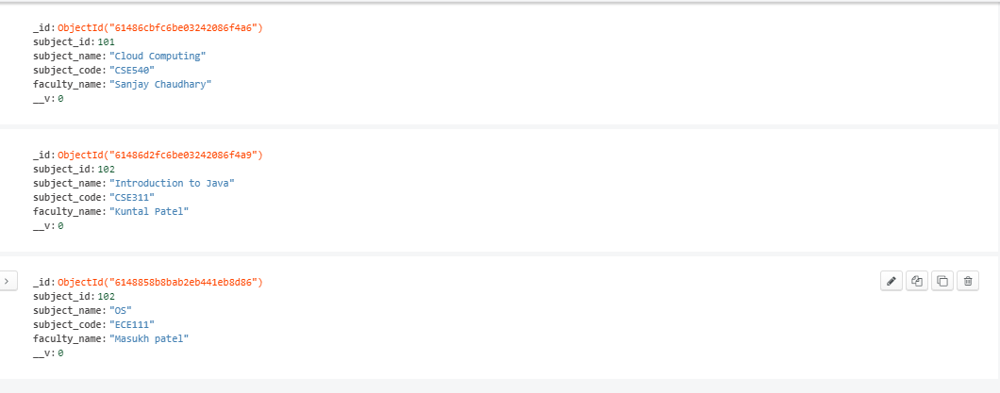

# Subject-Management-System
# Introduction 
This repository is Subject Managment system where proffessor can add multiple subjects and diffrent views by Id and Subject name.

## Tech Stack
- NodeJS
- MongoDb
- ExpressJS

## API Endpoints 
- Subject Addition :  subject/addSubject 
- View Subject by Id :  subject/subjectId 
- View Subject by Name :  subject/subjectName 

## Database Structure 

